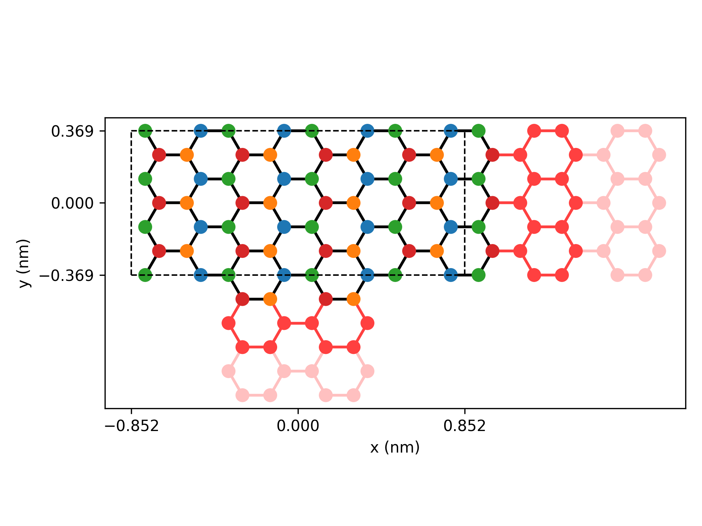
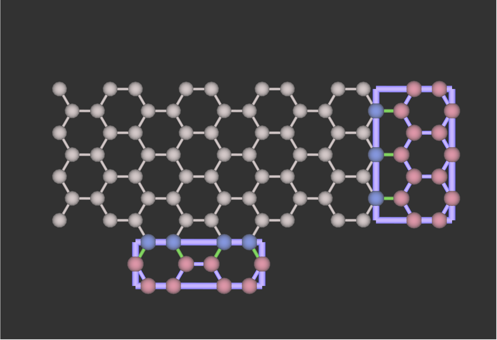

# bubel_writer_for_kwant
A script to extract out the information of lattice and hamiltonian of Kwant for bubel-viewer.

The information of bubel-viewer is in https://github.com/kmkolasinski/bubel-viewer/tree/master.

# To use the object Bubel_Writer
* `writer = Bubel_Writer(finalized system, name of basis)`:
  To get the position, name, number of orbitals and neighbors of each lattice point in the scattering region and leads.
  - `finalized system`: The first argument should be finalized system.
  - `name of basis`: The second argument is `optional` but the permutation of the name may be different from what you defined.
                   Note: Because the bubel-viewer does not support the string stype, the index of the name is used.

* `writer.writer(output file name, finalized system, argument_1, argument_2, ..., params=parameters)`
  To calculate the hamiltonian of the system and then write all information into .xml file.
  - `output file name`: The file name excludes the extension file name. It can include the path.
  - `arguments` and `parameters`: It is the same as what we use to calculate band structure, transmission and so on.

Note:
  1. This script does not support for three dimensional system.
  2. The lattice points of lead shown in the bubel-viewer do not exist in kwant. Please see the `flag(1)` introduced later for the detail.

# The definition in the script of flags shown in bubel-viewer
* `flag`: The index of the name of basis.
* `flag(0)`: Which part of system the lattice point is.
  - `0`: Scattering region.
  - `1`: Lead padding. Kwant will add new lattice points between scattering region and lead if the boundary does not end by a complete unit cell. But this is a part of scattering region defined by kwant. Please see the following example.
  - `>=2`: Leads. This number substract by 2 will be the index of the lead.
* `flag(1)`: The sites stored in the lead of kwant. Because of the translational symmetry of lead, kwant chooses the sites closing to the origin not closing to the interface.
  - value: The decimal number shown in bubel-viewer should be transform to the binary number to know which leads use. Eg. 2 (10) means used in the second lead. 3 (11) means used in the first and second leads.

# Samples

## No padding case

## Including padding case

